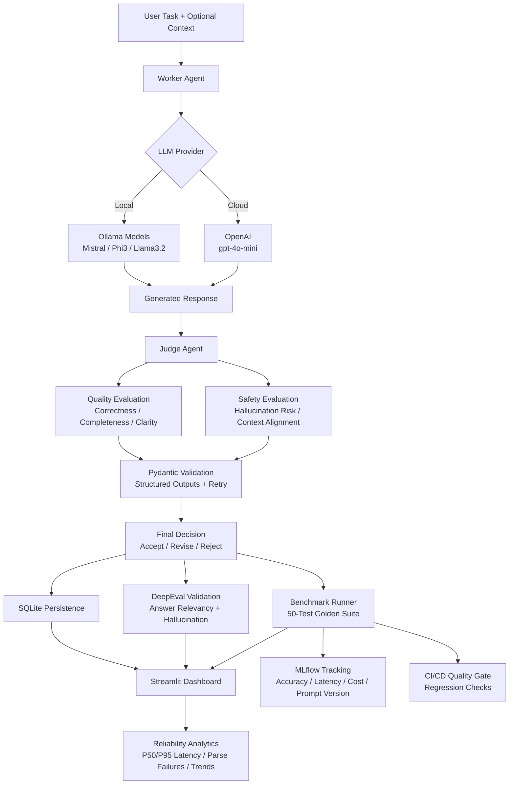
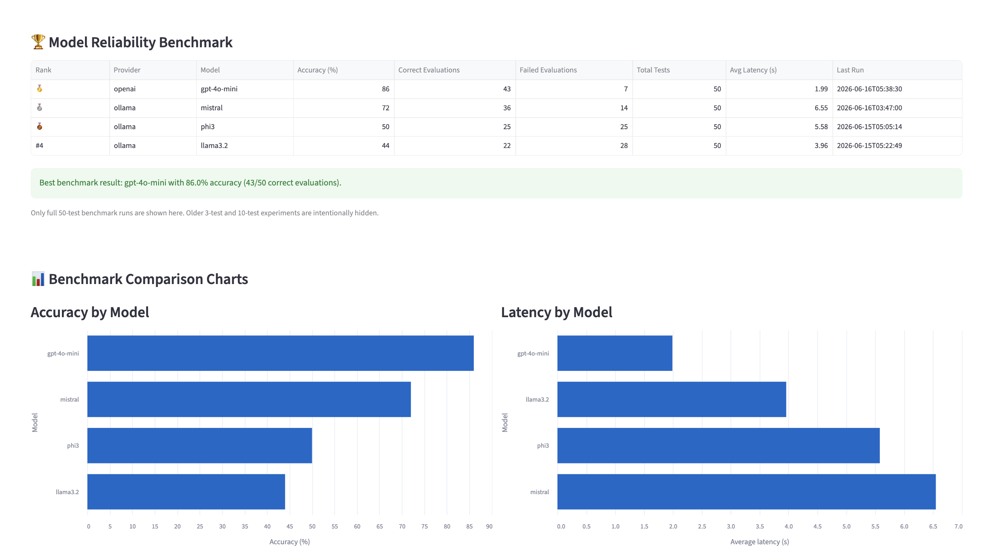
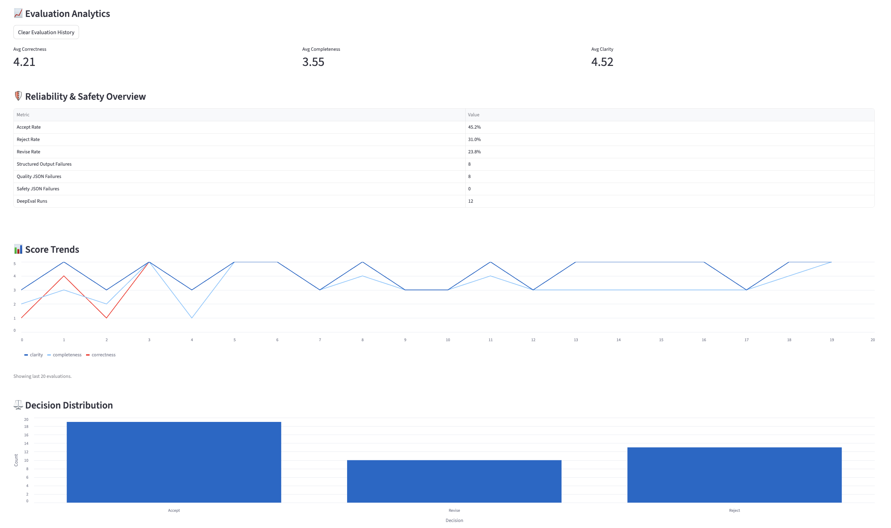
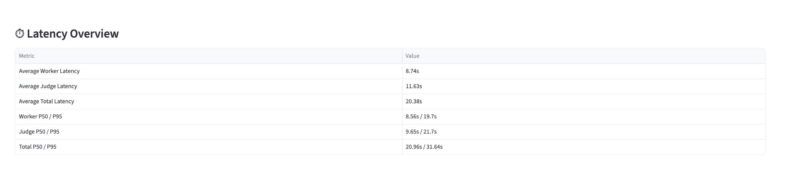
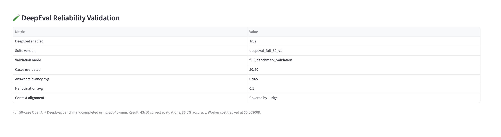
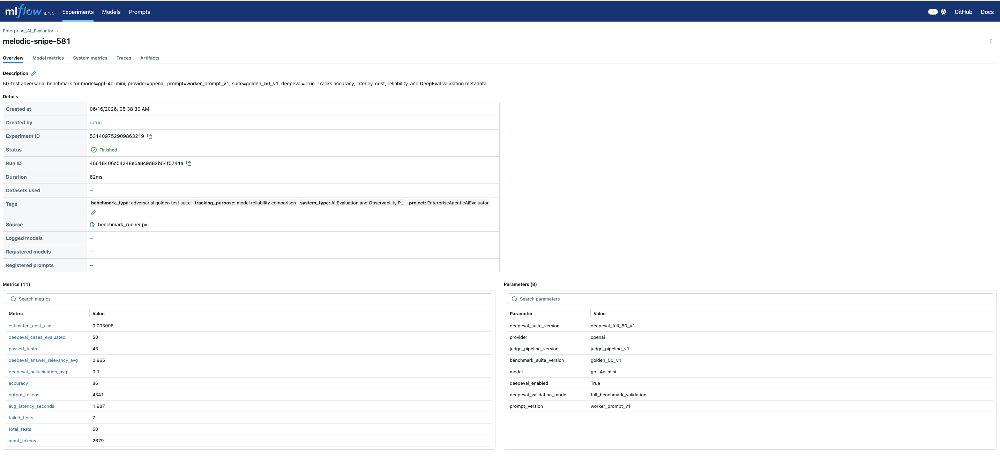

# Enterprise Agentic AI Evaluator

### Production AI Evaluation & Observability Platform for LLM Reliability


Choosing an LLM for production is rarely straightforward.

A model that performs well in demos may struggle with reliability, latency, instruction following, cost, or safety once deployed in real workflows. Teams often face difficult tradeoffs between local and cloud models while trying to balance quality, privacy, speed, and operational cost.

After working on retrieval based AI systems, I became interested in a harder engineering problem:

> **How do we know whether an LLM system is actually reliable before deployment?**

Most AI projects focus on generation. A prompt is given to a model, an answer is produced, and the workflow ends there.

In practice, production systems require much more.

Teams need ways to evaluate model quality, benchmark competing models, measure reliability, monitor latency, handle malformed outputs, and understand when system behavior starts degrading.

This project was built to explore those challenges.

**Enterprise Agentic AI Evaluator** is a production style platform for evaluating, benchmarking, and monitoring LLM systems through measurable signals instead of assumptions.

The platform compares both local models through **Ollama** and cloud models through **OpenAI**, allowing evaluation under real deployment constraints where privacy, latency, cost, and reliability all matter.

Instead of selecting models based on popularity or intuition, the system benchmarks models under a standardized adversarial evaluation suite to compare:

**response quality, reliability, latency, hallucination risk, and cost tradeoffs**

using measurable results.

The platform combines **multi agent evaluation, structured outputs with Pydantic, DeepEval validation, benchmark driven testing, MLflow experiment tracking, and reliability observability** to simulate how modern AI systems are evaluated in production environments.

---

## Table of Contents

1. [Why This Project Exists](#why-this-project-exists)
2. [Production Challenges in LLM Systems](#production-challenges-in-llm-systems)
3. [What the Platform Does](#what-the-platform-does)
4. [Engineering Decisions](#engineering-decisions)
5. [Benchmarking and Measurable Results](#benchmarking-and-measurable-results)
6. [Reliability and Observability](#reliability-and-observability)
7. [Architecture](#architecture)
8. [Dashboard and System Monitoring](#dashboard-and-system-monitoring)
9. [Technical Highlights](#technical-highlights)
10. [Project Structure](#project-structure)
11. [Running the Project Locally](#running-the-project-locally)
12. [CI Quality Gate](#ci-quality-gate)
13. [Future Work](#future-work)

---

## Why This Project Exists

While building retrieval based AI systems, I noticed something interesting:

> **Generating responses is only part of the problem.**

Modern LLMs are becoming increasingly capable at answering questions, summarizing information, and following instructions. Building prototypes has become significantly easier.

What becomes harder is answering questions such as:

- Can this system be trusted?
- Which model should actually be deployed?
- How consistently does the model follow instructions?
- What happens when outputs break expected formats?
- How do quality, latency, cost, and privacy tradeoffs change across models?
- How do we know when system performance starts degrading?

In many AI projects, these questions remain unanswered.

The workflow often ends once a model generates a reasonable response. But in production environments, teams need much stronger guarantees around reliability, measurement, and reproducibility.

A model that looks impressive in isolated examples may fail under adversarial inputs, struggle with instruction following, produce hallucinations, or become too expensive and slow for real deployment.

This becomes even more important when comparing local models and cloud APIs.

Local models may provide stronger privacy and lower operational cost, while cloud models often offer stronger reasoning performance. Choosing between them is rarely obvious.

That realization became the motivation for this project.

Instead of building another generation focused system, I wanted to explore a harder engineering problem:

> **How can LLM systems be evaluated, benchmarked, monitored, and improved before deployment decisions are made?**

The result is a platform focused on measurable evaluation rather than assumptions, helping compare models under the same conditions while tracking reliability, latency, quality, and operational tradeoffs over time.

---

## Production Challenges in LLM Systems

Building an LLM application is usually the easy part.

The harder challenge begins after the model produces an answer.

In production environments, teams need confidence that systems behave reliably across different inputs, changing contexts, and unexpected edge cases.

Several problems appear repeatedly.

### Inconsistent Response Quality

A model may perform well on simple examples but fail when instructions become ambiguous, context changes, or multiple constraints are introduced.

A response that appears convincing is not always correct.

Without evaluation mechanisms, weak outputs often go unnoticed.

### Hallucinations and Unsupported Claims

LLMs can generate answers that sound confident while containing incorrect or unsupported information.

This becomes especially risky in domains where factual accuracy matters.

Teams need ways to measure hallucination risk instead of assuming outputs are trustworthy.

### Model Selection Uncertainty

One of the most overlooked problems in applied AI is choosing the right model.

A larger or more popular model is not automatically the best deployment choice.

Different models make different tradeoffs between:

- response quality
- latency
- privacy
- cost
- instruction following
- reliability

A local model may offer lower cost and stronger privacy guarantees, while a cloud model may perform better on reasoning intensive tasks.

Choosing between them should be based on measurable evidence rather than assumptions.

### Lack of Observability

Even strong systems become difficult to trust when behavior cannot be measured.

Questions such as these become important over time:

- Is quality improving or degrading?
- Are latency spikes becoming more common?
- Which failure modes appear most often?
- How reliable is the evaluator itself?

Without observability, teams often discover problems only after users begin noticing them.

### Malformed Outputs and Reliability Failures

LLM systems frequently produce outputs that break expected structures.

In evaluation pipelines, malformed outputs can silently fail downstream systems, create inconsistent scoring, or reduce trust in automated evaluation.

Production systems need safeguards to handle failures gracefully instead of assuming perfect model behavior.

These challenges became the foundation for this project.

Rather than assuming models behave reliably, the platform focuses on measuring reliability, benchmarking tradeoffs, and making system behavior observable through real evaluation signals.

---

## What the Platform Does

The platform evaluates AI generated responses through a multi stage workflow designed to simulate how production systems monitor model quality and reliability.

At a high level, the workflow looks like this:

```text
Task → Response Generation → Multi Agent Evaluation → Structured Validation → Benchmarking → Persistence → Observability
```

The process begins with a user task and optional context.

A worker agent generates the initial response using either:

- local models through Ollama
- cloud models through OpenAI

This allows the same workflow to compare models under identical evaluation conditions.

Once a response is generated, it moves into a multi agent evaluation pipeline.

Instead of relying on a single evaluator, the platform separates quality assessment and safety assessment into independent judging components.

### Quality Evaluation

The quality judge evaluates dimensions such as:

- correctness
- completeness
- clarity

The goal is to measure whether the response is useful, accurate, and sufficiently complete for the requested task.

### Safety Evaluation

The safety judge evaluates:

- hallucination risk
- context alignment
- instruction adherence

This helps identify responses that appear convincing but violate context, ignore instructions, or introduce unsupported claims.

### Structured Validation and Reliability Safeguards

LLM outputs are inherently unpredictable.

To reduce reliability issues, judge outputs are validated using **Pydantic structured schemas**.

When malformed outputs occur, the platform applies retry logic and graceful fallback handling instead of allowing failures to silently propagate through the system.

This makes evaluation behavior more deterministic and resilient.

### DeepEval Validation

The platform also integrates **DeepEval** to validate evaluation quality using measurable signals such as:

- answer relevancy
- hallucination detection

This provides an additional layer of reliability checking beyond custom judge logic.

### Benchmarking, Persistence, and Experiment Tracking

Every evaluation is stored in a **SQLite backed persistence layer**, allowing historical tracking of:

- evaluation quality
- latency
- provider and model performance
- decision outcomes
- reliability trends

The platform also includes a **50 case adversarial benchmark suite** to compare models under standardized conditions.

Instead of comparing models through isolated examples, benchmarking uses the same evaluation pipeline across all models to generate measurable comparisons.

Benchmark runs are tracked through **MLflow experiment tracking** to improve reproducibility and make model iteration measurable.

This makes it possible to compare:

- model performance across runs
- benchmark accuracy
- latency differences
- prompt versions
- benchmark suite versions
- evaluation configurations

This makes improvements measurable and reduces the risk of silent regressions during development.

### Observability and Monitoring

Results are surfaced through a **Streamlit analytics dashboard** that provides visibility into:

- benchmark performance
- reliability trends
- latency distributions
- decision patterns
- model comparison
- evaluation history

This makes it possible to understand not only how a model performs, but also how system behavior changes over time.

---

## Engineering Decisions

Building an LLM system is not only about generating responses.

The harder challenge is building systems that remain reliable, measurable, and reproducible when model behavior becomes unpredictable.

Several design decisions were made intentionally to address those challenges.

### Why Separate Quality and Safety Judges?

Quality and safety are different problems.

A response may be factually correct but still unsafe. It may follow instructions while remaining incomplete or introducing unsupported claims.

To make evaluation behavior easier to interpret, the platform separates quality assessment and safety assessment into independent judging components.

**Quality evaluation focuses on:**

- correctness
- completeness
- clarity

**Safety evaluation focuses on:**

- hallucination risk
- context alignment
- instruction adherence

Separating these concerns makes failures easier to diagnose and allows the evaluation pipeline to evolve more independently over time.

This improves both interpretability and extensibility of the system.

### Why Structured Outputs with Pydantic?

LLMs frequently produce malformed or inconsistent outputs.

In production systems, unreliable output formats can silently break downstream workflows, reduce trust in automation, and create inconsistent behavior.

To improve determinism, judge outputs are validated using **Pydantic structured schemas**.

When outputs fail validation, retry logic and graceful fallback handling are applied instead of assuming perfect model behavior.

This makes evaluation more reliable and reduces the impact of malformed responses.

### Why Compare Local and Cloud Models?

Choosing an LLM for production is rarely straightforward.

Different deployment environments introduce different constraints.

Some systems prioritize:

- privacy
- lower operational cost
- low latency
- offline availability

Others prioritize:

- reasoning quality
- consistency
- stronger instruction following

To evaluate these tradeoffs, the platform compares both local models through **Ollama** and cloud models through **OpenAI** under identical benchmark conditions.

This makes model selection evidence based rather than assumption driven.

### Why Benchmark Models?

Model popularity is not a deployment strategy.

Different models behave differently under the same workload.

Instead of choosing models based on hype or assumptions, the platform benchmarks:

- Mistral
- Phi3
- Llama3.2
- GPT-4o-mini

using the:

- same benchmark suite
- same prompts
- same evaluation pipeline
- same scoring criteria

This makes it possible to compare:

- response quality
- latency
- reliability
- cost tradeoffs

through measurable results instead of intuition.

The goal is not to identify a universally “best” model, but to understand which models perform best under different operational constraints.

### Why MLflow Experiment Tracking?

LLM systems evolve continuously.

Prompts change, evaluation logic changes, models change, and benchmark results shift over time.

Without experiment tracking, it becomes difficult to understand whether changes improve or degrade system behavior.

Prompt versions are managed through `config/prompts.py` and tracked during benchmark runs so prompt changes can be compared instead of treated as invisible edits.

**MLflow** is used to track:

- benchmark accuracy
- latency
- prompt versions
- benchmark suite versions
- evaluation configurations

This improves reproducibility, enables experiment comparison, and makes improvements measurable across iterations.

---

## Benchmarking and Measurable Results

Choosing an LLM for production becomes significantly more difficult once systems move beyond prototypes.

A model that performs well in isolated examples may struggle with reliability, latency, instruction following, or cost when evaluated under more realistic conditions.

To make model selection measurable, the platform includes a **50 case adversarial benchmark suite** designed to evaluate models under standardized conditions.

The benchmark covers scenarios involving:

- context ambiguity
- hallucination traps
- prompt injection attempts
- contradiction handling
- multi constraint reasoning
- instruction following
- safety sensitive scenarios
- AI and machine learning concepts

Every model is evaluated using the:

- same benchmark suite
- same prompts
- same judging pipeline
- same scoring criteria

This keeps comparisons fair, reproducible, and measurable.

### Benchmark Results

| Model | Provider | Accuracy | Correct Evaluations | Average Latency |
|--------|-----------|-----------|----------------------|-----------------|
| GPT-4o-mini | OpenAI | **86%** | **43 / 50** | ~2.0s |
| Mistral | Ollama | **78%** | **39 / 50** | ~6.0s |
| Phi3 | Ollama | **50%** | **25 / 50** | ~5.6s |
| Llama3.2 | Ollama | **44%** | **22 / 50** | ~4.0s |

### Key Findings

**GPT-4o-mini** achieved the strongest overall benchmark performance, reaching **86% accuracy (43/50 correct evaluations)** while maintaining low latency.

Among local models, **Mistral** consistently delivered the strongest results, achieving **78% accuracy (39/50 correct evaluations)** and outperforming Phi3 and Llama3.2 in instruction following, context handling, and overall evaluation reliability.

Benchmarking also highlighted important deployment tradeoffs.

Cloud models delivered stronger reasoning quality and higher benchmark performance, while local models offered advantages around:

- privacy
- offline deployment
- lower operational cost
- deployment flexibility

This reinforced an important engineering lesson:

> **Choosing an LLM for production should be driven by measurable evaluation rather than popularity or assumptions.**

### Continuous Improvement Through Benchmarking

Benchmarking was not only used for model comparison.

It also became an iteration mechanism during development.

Through prompt refinement, evaluation improvements, structured validation, and reliability safeguards, benchmark performance improved over time.

For example:

> **Mistral benchmark accuracy improved from 60% → 78%**

This improvement provided measurable evidence that system changes were improving reliability rather than introducing silent regressions.

Instead of relying on intuition, improvements were validated through repeated benchmark evaluation.

This helped turn benchmarking into a feedback loop for continuous system improvement.

### DeepEval Validation

To add an additional layer of reliability validation, benchmark runs were also evaluated using **DeepEval**.

Current benchmark signals include:

- **Answer Relevancy:** 0.965
- **Hallucination Score:** 0.10

This provides measurable signals beyond custom judging logic and helps validate response quality more systematically.

---

## Reliability and Observability

Building an AI system is only part of the challenge.

Teams also need to understand when quality degrades, where failures occur, and why system behavior changes over time.

Without observability, issues often remain hidden until users begin noticing them.

For this reason, the platform includes reliability monitoring and observability features designed to make system behavior measurable rather than assumed.

### Latency Monitoring

LLM systems introduce latency at multiple stages.

To better understand system performance, the platform tracks:

- worker agent latency
- judge agent latency
- total pipeline latency

Instead of relying only on averages, the system measures both **P50** and **P95 latency** to better understand typical performance as well as worst case behavior.

Current observed latency metrics:

| Metric | P50 | P95 |
|---------|-----|-----|
| Worker Latency | 8.56s | 19.70s |
| Judge Latency | 9.65s | 21.70s |
| Total Pipeline Latency | 20.96s | 31.64s |

This makes performance behavior more visible under realistic workloads instead of isolated examples.

### Reliability Monitoring

The platform continuously tracks reliability signals to better understand evaluation quality and system behavior over time.

Currently tracked signals include:

- evaluation history
- benchmark history
- decision distribution
- parse failures
- provider and model performance
- latency trends
- cost tracking

This helps answer practical questions such as:

- Is evaluation quality improving or degrading?
- Which models are becoming more reliable?
- Are latency spikes becoming more frequent?
- Which failure patterns appear repeatedly?

Instead of treating evaluations as isolated runs, the platform makes long term behavior measurable.

### Failure Handling and Resilience

LLM systems are inherently unpredictable.

Malformed outputs, timeout issues, inconsistent formatting, and schema violations can introduce reliability problems if not handled carefully.

To improve resilience, the platform includes:

- schema validation through Pydantic
- retry logic for malformed outputs
- graceful fallback handling
- request timeout protection
- CI based regression detection

Across **42 recorded evaluations**, the system observed:

- **8 quality parse failures**
- **0 safety parse failures**

This helped validate that reliability safeguards were working effectively and that evaluation failures could be handled without breaking downstream workflows.

### Historical Tracking and Persistence

To support long term monitoring, the platform stores:

- **42 evaluation records**
- **41 benchmark runs**

through a **SQLite backed persistence layer** with CSV exports for additional analysis.

This creates an audit trail for understanding:

- how benchmark performance changes
- how reliability evolves
- how model behavior shifts across iterations
- how evaluation decisions change over time

The goal is not only to evaluate responses, but also to make the evaluation system itself observable, measurable, and easier to improve over time.

---

## Architecture

The platform is designed around a modular evaluation workflow where response generation, evaluation, validation, benchmarking, and observability remain separate concerns.

Instead of relying on a single monolithic pipeline, the system separates worker generation, quality evaluation, safety evaluation, structured validation, benchmarking, and monitoring into independent components.

This makes the platform easier to extend, debug, benchmark, and improve over time.

At a high level, the workflow follows:

```text
Task → Worker Agent → Quality & Safety Judges → Pydantic Validation → DeepEval Validation → Persistence → Benchmarking → Observability Dashboard
```

The architecture also supports both local models through **Ollama** and cloud models through **OpenAI**, enabling model comparison under the same evaluation conditions.

### System Architecture



For a more detailed architectural explanation, see:

```text
docs/architecture.md
```

---

## Dashboard and System Monitoring

The platform includes a **Streamlit based analytics dashboard** designed to make evaluation quality, benchmarking, reliability, and system behavior observable.

Rather than treating evaluations as isolated outputs, the dashboard helps monitor how models behave across repeated evaluations and benchmark cycles.

The interface is designed to surface measurable signals around:

- benchmark performance
- model comparison
- reliability trends
- latency behavior
- decision distribution
- evaluation history
- benchmark history
- cost visibility
- experiment tracking

The screenshots below highlight selected parts of the platform used to evaluate, benchmark, and monitor LLM reliability.

### 1. Benchmark Leaderboard

Benchmark comparison across local and cloud models evaluated under identical benchmark conditions.

Shows measurable differences in:

- benchmark accuracy
- latency
- provider performance
- model reliability

This supports benchmark driven model selection rather than assumption based decisions.

Current benchmark highlights:

- **GPT-4o-mini:** 86% accuracy (**43/50 correct evaluations**)
- **Mistral:** 78% accuracy (**39/50 correct evaluations**)



---

### 2. Reliability Dashboard

Reliability monitoring dashboard showing evaluation quality, benchmark trends, decision distribution, and historical system behavior.

Designed to help identify:

- reliability degradation
- recurring failure patterns
- model behavior changes over time

This makes it easier to understand how system quality evolves instead of evaluating isolated outputs.



---

### 3. Latency Monitoring and Observability

**P50 and P95 latency monitoring** across worker agents, judge agents, and total pipeline performance.

Used to understand both:

- normal system behavior
- worst case latency scenarios

Current observed latency metrics:

| Metric | P50 | P95 |
|---------|-----|-----|
| Worker Latency | 8.56s | 19.70s |
| Judge Latency | 9.65s | 21.70s |
| Total Pipeline Latency | 20.96s | 31.64s |

This helps make performance behavior observable under realistic workloads rather than isolated examples.



---

### 4. DeepEval Validation Results

**DeepEval based validation** used to measure answer relevancy and hallucination risk signals.

Provides an additional reliability layer beyond custom judging logic.

Current benchmark validation signals:

- **Answer Relevancy:** 0.965
- **Hallucination Score:** 0.10

This helps validate response quality through measurable signals beyond custom evaluation logic.



---

### 5. MLflow Experiment Tracking

Experiment tracking and reproducibility monitoring across benchmark runs.

Used to compare:

- benchmark accuracy
- latency changes
- prompt versions
- benchmark suite versions
- evaluation configurations

This makes development iterations measurable and reduces the risk of unnoticed regressions over time.



---

## Technical Highlights

The platform combines evaluation, benchmarking, reliability engineering, and observability components commonly used in modern LLM systems.

The technologies below were selected intentionally to support reproducibility, measurable evaluation, reliability, and production style experimentation.

| Technology | Purpose |
|-------------|---------|
| Python | Core orchestration for evaluation workflows, benchmarking, observability, and reliability tracking |
| OpenAI API | Cloud model evaluation and benchmarking using GPT-4o-mini |
| Ollama | Local model inference and benchmarking using Mistral, Phi3, and Llama3.2 |
| Streamlit | Analytics dashboard for reliability monitoring, benchmarking, and system observability |
| SQLite | Persistent storage for evaluation history, benchmark runs, latency tracking, and reliability analysis |
| CSV Exports | Lightweight debugging, offline analysis, and evaluation inspection |
| Pydantic | Structured validation for judge outputs with retry and graceful fallback handling |
| DeepEval | External evaluation signals for answer relevancy and hallucination risk validation |
| MLflow | Experiment tracking, reproducibility, prompt versioning, and benchmark comparison |
| Pandas | Data processing for evaluation analytics, benchmarking, and historical trend analysis |
| Altair | Benchmark visualization and reliability focused analytics charts |
| GitHub Actions | CI based quality gates for regression prevention and benchmark validation |
| dotenv (`.env`) | Secure environment configuration and API key management |

### Core Engineering Focus

The project is primarily focused on:

- LLM evaluation and benchmarking
- reliability engineering for AI systems
- observability and monitoring
- structured outputs and validation
- model selection through measurable evaluation
- prompt versioning and reproducibility
- local versus cloud model tradeoff analysis
- production style AI system design

Rather than optimizing only for response generation, the platform focuses on understanding how reliable an LLM system actually is before deployment decisions are made.

---

## Project Structure

The project is organized into modular components to keep evaluation, benchmarking, persistence, and observability concerns separated.

```text
EnterpriseAgenticAIEvaluator/
│
├── agents/
│   ├── worker_agent.py
│   ├── judge_agent.py
│   ├── quality_judge.py
│   ├── safety_judge.py
│   ├── deepeval_judge.py
│   └── schemas.py
│
├── assets/
│   └── images/
│       ├── benchmark-leaderboard.png
│       ├── reliability-dashboard.png
│       ├── latency-monitoring.png
│       ├── deepeval-results.png
│       └── mlflow-tracking.png
│
├── config/
│   ├── pricing.py
│   └── prompts.py
│
├── data/
│   ├── evaluations.db
│   ├── evaluations.csv     # local generated
│   └── golden_tests.json   # local generated
│
├── docs/
│   └── architecture.md
│
├── experiment_logs/
│   ├── benchmark_final_mlflow.txt
│   ├── benchmark_llama32.txt
│   ├── benchmark_mistral.txt
│   ├── benchmark_openai_50.txt
│   ├── benchmark_openai_deepeval_50.txt
│   └── benchmark_phi3.txt
│
├── reports/
│   ├── benchmark_results.json
│   ├── benchmark_summary.md
│   └── deepeval_summary.json
│
├── utils/
│   └── logger.py
│
├── .env.example
├── app.py
├── benchmark_loader.py
├── benchmark_runner.py
├── ci_quality_gate.py
├── database.py
├── deepeval_runner.py
├── llm_client.py
├── mlflow_logger.py
├── requirements.txt
└── README.md
```

### Key Components

| Component | Responsibility |
|------------|----------------|
| `agents/` | Multi agent evaluation pipeline for response generation, quality evaluation, safety evaluation, and DeepEval validation |
| `config/` | Prompt versioning and cost configuration |
| `data/` | SQLite persistence, CSV exports, and benchmark dataset |
| `reports/` | Benchmark summaries and evaluation reports |
| `app.py` | Streamlit dashboard for benchmarking, observability, and reliability monitoring |
| `benchmark_runner.py` | Offline benchmark execution across models |
| `database.py` | Evaluation and benchmark persistence layer |
| `llm_client.py` | OpenAI and Ollama provider integration with timeout handling |
| `mlflow_logger.py` | Experiment tracking and reproducibility logging |
| `ci_quality_gate.py` | Benchmark regression protection for CI workflows |

The modular structure makes it easier to extend evaluation logic, benchmark additional models, improve reliability safeguards, and iterate on prompts without tightly coupling components.

---

## Running the Project Locally

### 1. Clone the Repository

```bash
git clone https://github.com/rutujad9/EnterpriseAgenticAIEvaluator.git
cd EnterpriseAgenticAIEvaluator
```

### 2. Create a Virtual Environment

```bash
python -m venv venv
source venv/bin/activate
```

For Windows:

```bash
venv\Scripts\activate
```

### 3. Install Dependencies

```bash
pip install -r requirements.txt
```

### 4. Configure Environment Variables

Create a `.env` file in the project root.

You can use `.env.example` as a reference:

```bash
cp .env.example .env
```

Example configuration:

```env
LLM_PROVIDER=openai
OPENAI_API_KEY=your_api_key_here
OPENAI_MODEL=gpt-4o-mini

OLLAMA_MODEL=mistral

DEEPEVAL_ENABLED=false
LLM_TIMEOUT_SECONDS=120
```

The platform supports both:

- OpenAI models for cloud benchmarking
- Ollama models for local inference and privacy focused workflows

To switch providers, update:

```env
LLM_PROVIDER=openai
```

or:

```env
LLM_PROVIDER=ollama
```

### 5. Run the Analytics Dashboard

```bash
streamlit run app.py
```

This launches the dashboard for:

- benchmark comparison
- reliability monitoring
- latency observability
- evaluation history
- provider comparison

### 6. Run the Benchmark Suite

Execute the 50 case adversarial benchmark suite:

```bash
python benchmark_runner.py
```

This evaluates models under identical benchmark conditions and stores benchmark results for comparison and analysis.

### 7. Run the CI Quality Gate

Validate benchmark quality and regression thresholds locally:

```bash
python ci_quality_gate.py
```

This checks:

- benchmark accuracy thresholds
- golden dataset integrity
- pipeline stability

### 8. Run DeepEval Validation Optional

To run DeepEval based validation:

```bash
python deepeval_runner.py
```

DeepEval provides additional signals around:

- answer relevancy
- hallucination risk

### 9. Open MLflow Tracking UI Optional

To inspect benchmark experiments:

```bash
mlflow ui
```

Open:

```text
http://127.0.0.1:5000
```

to compare benchmark runs, prompt versions, and evaluation configurations.

---

## CI Quality Gate

AI systems can silently regress.

A prompt update, evaluation change, or model replacement may unintentionally reduce response quality without being immediately obvious.

To reduce this risk, the project includes a **CI based quality gate using GitHub Actions**.

Instead of assuming system quality remains stable, every change is automatically validated against reliability and benchmark expectations.

The CI workflow performs checks for:

- Python compilation and syntax validation
- golden benchmark dataset integrity
- benchmark accuracy thresholds
- evaluation pipeline stability

### Regression Prevention

The platform treats benchmarking as a quality safeguard, not a one time experiment.

Changes that unintentionally reduce benchmark quality can be identified early before affecting system reliability.

This helps reduce the risk of:

- silent quality degradation
- broken evaluation logic
- unstable benchmark behavior
- unnoticed reliability regressions

### Benchmark Protection

The quality gate currently enforces a minimum benchmark threshold to protect against performance drops during development.

Current validation includes:

- 50 case golden benchmark integrity
- minimum benchmark accuracy threshold
- evaluation pipeline consistency

### Example Workflow

```text
Push / Pull Request
        ↓
Install Dependencies
        ↓
Compile Python Files
        ↓
Run CI Quality Gate
        ↓
Validate Benchmark Quality
        ↓
Pass / Fail Build
```

This turns benchmarking into a continuous reliability mechanism rather than a one time validation step.

Instead of asking:

> “Did the code run?”

the system also asks:

> **“Did reliability stay intact?”**

---

## Future Work

The current platform focuses on evaluation reliability, benchmarking, observability, and measurable model comparison.

Several improvements remain intentionally scoped for future iterations.

### Exportable Benchmark Reports

Add automated **PDF benchmark reports** to make evaluation results easier to share and compare across benchmark runs.

Potential additions include:

- benchmark summaries
- model comparison reports
- latency breakdowns
- reliability trends
- DeepEval validation signals

### Containerized Deployment

Add **Docker based deployment** to simplify reproducibility and make the platform easier to run across different environments.

This would improve:

- portability
- environment consistency
- onboarding simplicity

### Expanded DeepEval Metrics

Extend **DeepEval** integration beyond current validation signals.

Potential additions include:

- faithfulness metrics
- contextual alignment evaluation
- expanded hallucination analysis

This would provide broader external validation alongside custom judge based evaluation.

### Full Evaluation Trace Logging

Extend observability through richer evaluation tracing.

Potential future signals include:

- prompt level tracing
- model response comparisons
- evaluation decision traces
- stage wise latency breakdowns

This would make debugging, reliability analysis, and failure diagnosis more granular over time.

The goal of future work is not to add unnecessary complexity, but to improve reproducibility, evaluation reliability, and observability for production oriented LLM systems.

---

## Author

**Rutuja D**

MSc Informatik - Germany

GitHub: https://github.com/rutujad9
LinkedIn: https://linkedin.com/in/rutuja-rd

---

## License

This project is provided for educational, research, and portfolio purposes.

The code and documentation may be referenced for learning and non-commercial use. No warranty is provided, and the project is distributed as-is.

---

