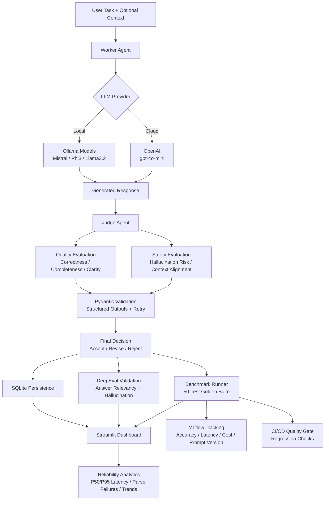

# Architecture

```mermaid
flowchart TD
    A[User Task + Optional Context] --> B[Worker Agent]

    B --> C{LLM Provider}
    C -->|Local| D[Ollama Models<br/>Mistral / Phi3 / Llama3.2]
    C -->|Cloud| E[OpenAI<br/>gpt-4o-mini]

    D --> F[Generated Response]
    E --> F[Generated Response]

    F --> G[Judge Agent]

    G --> H[Quality Evaluation<br/>Correctness / Completeness / Clarity]
    G --> I[Safety Evaluation<br/>Hallucination Risk / Context Alignment]

    H --> J[Pydantic Validation<br/>Structured Outputs + Retry]
    I --> J

    J --> K[Final Decision<br/>Accept / Revise / Reject]

    K --> L[SQLite Persistence]
    K --> M[DeepEval Validation<br/>Answer Relevancy + Hallucination]
    K --> N[Benchmark Runner<br/>50-Test Golden Suite]

    L --> O[Streamlit Dashboard]
    M --> O
    N --> O

    N --> P[MLflow Tracking<br/>Accuracy / Latency / Cost / Prompt Version]
    N --> Q[CI/CD Quality Gate<br/>Regression Checks]

    O --> R[Reliability Analytics<br/>P50/P95 Latency / Parse Failures / Trends]
```
